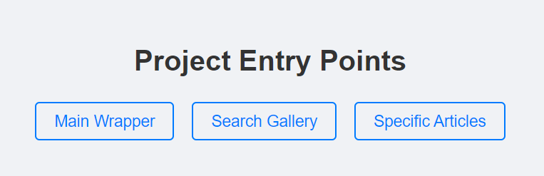

# QuickPubMed Web application

This project contains the source code for the product QuickPubMed hosted on
[videncenterfordiabetes.dk](https://videncenterfordiabetes.dk/)


## Prerequisites

**Backend (PHP)**

- PHP 8.x installed locally (recommended with `openssl` and `curl` enabled)

**Frontend (Vue web app)**

- Node.Js and NPM installed locally. [Download here](https://nodejs.org/en/download/prebuilt-installer/current)

**Cloning the repositories**

- You need the git tool to enable cloning, pulling and pushing. There are two options: [git CLI](https://git-scm.com/downloads) or [GitHub Desktop (GUI for git)](https://desktop.github.com/download/) 
- Go with GitHub Desktop if you prefer the graphical user interface.


- SSH key for cloning with git CLI [Generate SSH key locally and add it to your github profile](https://docs.github.com/en/authentication/connecting-to-github-with-ssh/adding-a-new-ssh-key-to-your-github-account)

  
## Setup for local development

### Frontend project

The **frontend** project can be cloned as such using ssh (asuming you only use the git CLI) [See this if using GitHub Desktop](https://docs.github.com/en/desktop/adding-and-cloning-repositories/cloning-a-repository-from-github-to-github-desktop)

```bash
git clone git@github.com:danishdiabetesknowledgecenter/QuickPubMed.git
cd QuickPubMed
```

**Install dependencies**

```bash
npm install
```

**Create and fill in values for .env**

- check the .env.example file to see which are needed

**Start development server:**

```bash
npm run dev
```

This will start the Vite development server at `http://localhost:5173`

The app defines entry points under `entries/widgets`
When opening the root directory at `http://localhost:5173` you'll see a simple menu for navigating to these entry points.


#### Local dev API modes (backend)

For local frontend development, you can use one of these API modes:

- **Recommended (remote backend via Vite proxy)**  
  Set `VITE_API_PROXY_URL="/backend"` in `.env`.  
  Vite will proxy `/backend/*` requests to `https://qpm.videncenterfordiabetes.dk/dev/latest/*` (configured in `vite.config.js`), which avoids browser CORS issues during local development.

- **Local PHP backend**  
  Set `VITE_API_PROXY_URL="http://localhost:8080/backend"` in `.env`.  
  This requires a local PHP runtime with `openssl` and `curl` enabled.

#### Runtime content and domain-specific rules

To keep the frontend bundle generic, domain-specific content is loaded at runtime from backend storage:

- `backend/storage/content/<domain>/topics.json`
- `backend/storage/content/filters.json`
- `backend/storage/content/<domain>/prompt-rules.json`

Frontend reads this via `backend/api/PublicContent.php`:

- `?type=topics&domain=<domain>`
- `?type=filters`
- `?type=prompt-rules&domain=<domain>`

### Backend project

The backend is part of this same repository under `backend/`.

**Local PHP backend (optional for local API mode):**

```bash
php -S localhost:8080 -t backend
```

Then use in `.env`:

```bash
VITE_API_PROXY_URL="http://localhost:8080/backend"
```

### Start developing

- You're ready to start creating features👌

## Branching Strategy

Follow the feature branch strategy for adding new features.

```
main (deployment branch) ←← dev(consolidate features) ←← feature/<name-of-feature>
```

_Notice: Avoid pushing directly to the main branch, this is currently not enforced by rules since the repository is private_

### Naming conventions for shortlived branches

- _Bug fixes_
  - bug/name-of-bug (or github issue id)
- _Features_
  - feature/name-of-feature

### Creating a Pull Request (PR)

When multiple people are working on a project it is common practice to consolidate features on the dev branch before a deployment is triggered.

1. Push your feature branch to GitHub
2. Go to repository on GitHub
3. Click "Pull requests" → "New pull request"
4. Select:
   - Base: `dev` (for feature merges)
   - Compare: `feature/your-feature-name`
5. Fill in:
   - Title: Brief description of changes
   - Description: Detailed explanation of changes
   - (_optional_) Reviewers: Assign team members for review

#### PR Best Practices

- Keep changes focused and atomic
- Include tests if applicable
- Reference related issues
- Update documentation if needed

## Deployment and release of new version

### GitHub Actions Workflow

The project uses GitHub Actions for automated deployment. The workflow is defined in `.github/workflows/main.yml`.

When a feature (or multiple consolidated features) should be deployed:

1. Create PR from `dev` to `main`
2. Review and merge PR (include relevant info in title and description)
3. [Create a new release, with a new tag](https://github.com/danishdiabetesknowledgecenter/QuickPubMed/releases)
4. The new tag will trigger the GitHub Actions automatically which will:
   - Build the application
   - Deploy to the FTP server
   - Only the `dist` folder is deployed which contains the bundled code

[The deployed app can be viewed here](https://pro.videncenterfordiabetes.dk/nempubmed/it-minds)

If there are updates that should also be included in the same release, then create the new tag locally and push it to origin. (Assuming you only use the git CLI) [See this if using GitHub Desktop to manage tags](https://docs.github.com/en/desktop/managing-commits/managing-tags-in-github-desktop)

```
git checkout main
git tag (to view prior local tags, or find latest tag on github)
git tag <new-tag-name> (eg. v2.1.12)
git push origin <new-tag-name>
```
### GitHub Secrets

The workflow uses the following secrets for secure deployment:

- `FTP_SERVER`: FTP server address
- `FTP_USERNAME`: FTP account username
- `FTP_PASSWORD`: FTP account password

To add/update secrets:

1. Go to repository Settings
2. Navigate to Secrets and variables → Actions
3. Click "New repository secret"
4. Add required secrets

Furthermore make sure that the enviroment varibels defined in the main.yml are created as [Secrets in GitHub](https://github.com/danishdiabetesknowledgecenter/QuickPubMed/settings/secrets/actions)

[Click here to see secrets defined in the repository](https://github.com/danishdiabetesknowledgecenter/QuickPubMed/settings/secrets/actions)

## Notes

- The application is built using Vue 3 and Vite 5
- Deployment is configured for static hosting
- Build artifacts are optimized for production

  [](https://github.com/SamKirkland/FTP-Deploy-Action)

### Managing tasks for open-source or internal work

All GitHub repositories have a tab for creating and managing [issues](https://github.com/danishdiabetesknowledgecenter/QuickPubMed/issues)

Use this to report bugs or request new feature. These issues can be directly linked to a branch and resolved when a branch is merged into dev.

### Linting and Formatting

Maintaining consistent code quality and style is essential for collaborative development. This project utilizes ESLint for linting and Prettier for code formatting.

#### Troubleshooting

Should there be any issues running commands for npm or php, make sure the terminal is started with sufficient rights, and that you've restarted the system after installing required packages.

If a wrong version of something is installed this might cause issues. You can check the version of node or dotnet by appending " --version" to the name of the tool.

#### Tools Used

- ESLint: Identifies and fixes problematic patterns in JavaScript and Vue.js code.
- Prettier: Enforces a consistent code style by automatically formatting code.
  Setup Instructions
  Install Dependencies

Ensure you have Node.js and NPM installed. Then, install the necessary development dependencies:

Create **.vscode/settings.json** and add in the configuration below

```json
{
  "editor.formatOnSave": true,
  "editor.defaultFormatter": "esbenp.prettier-vscode",
  "editor.codeActionsOnSave": {
    "source.fixAll.eslint": "explicit"
  },
  "eslint.validate": ["javascript", "javascriptreact", "vue"]
}
```
