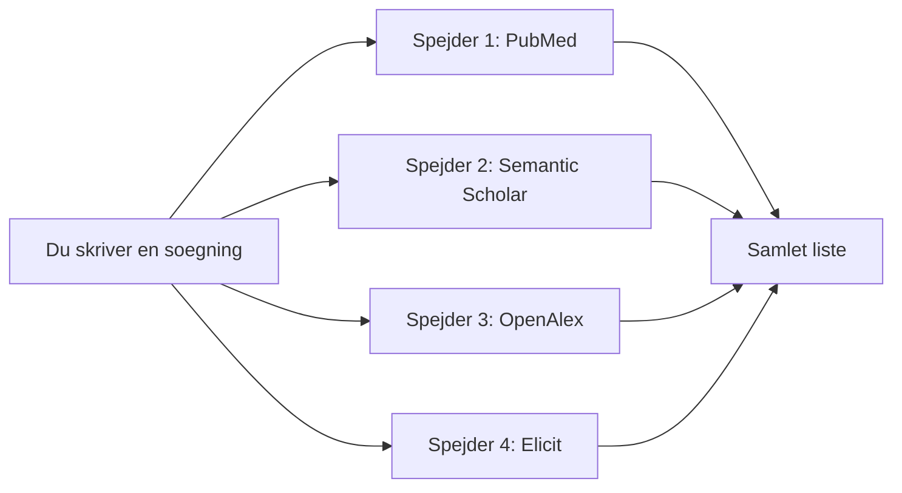
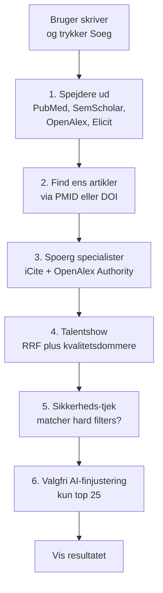

# Sådan virker søgningen — forklaret for en 12-årig

Det her dokument forklarer i helt almindeligt sprog, hvad QuickPubMed gør, når nogen skriver noget ind og trykker på "Søg". Det er tænkt som en introduktion, man kan læse højt.

Hvis du bagefter vil dykke ned i detaljerne, findes der tekniske dokumenter:

- `backend/docs/search-flow-readme.md` — den tekniske version
- `backend/docs/search-flow-diagram.md` — diagrammer
- `backend/docs/semantic-filter-regression-checklist.md` — test-tjekliste

## Hvad er problemet?

Forestil dig, at du skal finde de 20 bedste videnskabelige artikler om "sukkersyge hos børn". Der findes millioner af artikler i verden. Hvordan finder du ud af, hvilke der er vigtigst?

En almindelig søgemaskine er som at søge på Google: den finder alt, der nævner ordene. Men det er ikke altid de bedste artikler, der kommer øverst.

QuickPubMed er som en dygtig bibliotekar, der gør tre ting:

1. **Finder** en masse mulige artikler fra forskellige steder
2. **Undersøger** hvor gode de er
3. **Sorterer** dem, så de bedste kommer øverst

## Del 1: Vi sender spejdere ud

Når du trykker på "Søg", sender QuickPubMed **flere spejdere** ud samtidig. Hver spejder leder i sin egen "bibliotek":

- **PubMed** — det store medicinske bibliotek, som National Library of Medicine i USA passer på
- **Semantic Scholar** — et bibliotek drevet af en AI-organisation der forstår betydning af tekst
- **OpenAlex** — et åbent bibliotek over videnskabelige artikler
- **Elicit** — en AI-søgemaskine der forstår naturligt sprog

Hver spejder kommer tilbage med en liste over artikler, han mener er relevante. Nogle artikler findes kun hos én spejder. Nogle findes hos flere.



## Del 2: Vi finder ud af, hvilke artikler der er ens

Sommetider finder to spejdere den samme artikel. Så skal vi være smarte:

- Hvis artiklen har et **PMID-nummer** (National Library of Medicine's id-nummer), kigger vi på det. Hvis det er det samme, er det den samme artikel.
- Hvis der ikke er noget PMID, bruger vi **DOI** (Digital Object Identifier — en slags stregkode til videnskabelige artikler).

Artikler der findes hos flere spejdere får senere en lille bonus, fordi det er et tegn på at den er ekstra relevant.

## Del 3: Vi henter ekstra oplysninger (enrichment)

Nu har vi en liste over kandidater. Men vi vil gerne vide mere om hver enkelt artikel. Derfor ringer vi til to specialister:

### NIH iCite (den medicinske ekspert)

iCite er en gratis tjeneste fra USA's National Institutes of Health, der ved meget om medicinske artikler. Vi spørger den:

- **Hvor populær er artiklen sammenlignet med andre lignende artikler?** (det tal hedder "RCR")
- **Er det en klinisk artikel, altså noget læger kan bruge direkte på patienter?**
- **Hvor mange læger og klinikere har citeret den?**

### OpenAlex Authority (forfatter- og tidsskrifts-eksperten)

Vi spørger OpenAlex:

- **Hvor dygtige er forfatterne?** (målt med en score der hedder h-index)
- **Er tidsskriftet prestigefyldt?** (målt med hvor ofte det bliver citeret)

**Vigtig regel:** Hvis en af specialisterne ikke svarer, går vi videre uden de ekstra oplysninger. Vi giver aldrig op og viser ingen resultater.

## Del 4: Vi holder et talentshow (reranking)

Nu er den vigtige del: Hvilken rækkefølge skal artiklerne stå i?

Forestil dig et talentshow med dommere. Hver artikel får point fra flere dommere:

### Dommer 1: Rækkefølge-dommeren (RRF)

RRF står for **Reciprocal Rank Fusion**. Det lyder fancy, men det betyder bare:

> "Jo højere oppe en artikel var hos en spejder, jo flere point får den."

Hvis Semantic Scholar satte artiklen som nummer 1 på sin liste, får den mange point. Hvis den var nummer 50, får den færre.

Hvis flere spejdere var enige om at artiklen var god, får den point fra hver af dem. Det er derfor, multi-source-artikler ofte vinder.

### Dommer 2: PMID-dommeren

Artikler med et PMID-nummer får en lille bonus. Det er fordi PMID betyder, at artiklen er registreret i det officielle medicinske bibliotek og kan valideres grundigt.

### Dommer 3: Overlap-dommeren

Hvis den samme artikel blev fundet af flere spejdere, får den en ekstra bonus. Det er som når flere venner anbefaler samme film — det er nok en god film.

### Dommer 4: Kvalitets-dommerne (de nye!)

Det her er de smarte dommere vi har tilføjet:

**Alders-dommeren** (recency)
- Giver flere point til nyere artikler
- Bruger en halveringstid: hvis halveringstiden er 5 år, giver en artikel fra i år fuld bonus, mens en fra 5 år siden får halv bonus, og en fra 10 år siden får en fjerdedel.

**Artikel-type-dommeren** (pubType)
- Nogle artikel-typer er mere værd end andre i medicin
- Systematiske reviews og meta-analyser er "guld-standarden" — de samler viden fra mange studier
- Randomiserede kliniske forsøg er også stærke
- Editorials og læserbreve har mindre videnskabelig vægt

**Citat-dommeren** (citation impact)
- Kigger på, hvor populær artiklen er målt mod andre artikler i samme felt (det er vigtigt, så vi ikke straffer nye forskningsområder)
- Rækkefølgen af hvad vi kigger på: RCR (fra iCite, kun PubMed-artikler) → FWCI (fra OpenAlex) → "influential citations" (fra Semantic Scholar) → rå antal citationer
- Vi tager den første tilgængelige værdi — hvis iCite ikke kender artiklen, falder vi ned til FWCI og så videre

**Trukket-tilbage-dommeren** (retraction)
- Hvis en artikel er blevet trukket tilbage (retracted), fordi den viste sig at være forkert eller fup, kan vi:
  - Slet fjerne den (`filter`)
  - Straffe den hårdt, så den lander nederst (`penalty`)
  - Ignorere problemet (`none`)
- I en klinisk app som QuickPubMed bruger vi typisk `filter`, så læger ikke ser tilbagetrukne artikler

**Open Access-dommeren** (oaBonus)
- Lille bonus til artikler der er gratis tilgængelige at læse

**Klinik-dommeren** (clinical)
- Bonus til artikler som iCite har markeret som klinisk relevante

**Emne-match-dommeren** (topic overlap)
- Bonus til artikler hvis emne matcher ordene i din søgning
- Bruger OpenAlex's kategorisering til at finde ud af, om artiklen handler om det samme som du spurgte efter

**Autoritets-dommeren** (authority)
- Kigger på forfatterens h-index og tidsskriftets citationer
- **Denne dommer er slået fra som standard**, fordi h-index favoriserer ældre forskere og store forskningsområder urimeligt

## Del 5: Hvordan regnes pointene sammen?

Hvis du har hørt om et regnskab, er det nemt. Vi har to slags point:

**Plus-point** (additive):
Dommer 1, 2, 3 og nogle af kvalitets-dommerne lægger point oven i hinanden.

**Gange-point** (multiplicative):
Citat-dommeren, autoritets-dommeren og trukket-tilbage-dommeren ganger den samlede score med et tal mellem 0.5 og 1.3.

Den endelige formel ser sådan ud:

```
slutresultat = (alle plus-point) * (alle gange-point)
```

**Konkret eksempel:** En systematic review fra 2024 der er klinisk relevant og højt citeret:

```
Plus-point:
  RRF-point fra 2 spejdere:    180
  PMID-bonus:                   10
  Overlap-bonus:                35
  Alders-bonus (ny artikel):    15
  Artikel-type-bonus (SR):      25
  Klinik-bonus:                 12
  ---
  Total plus:                  277

Gange-point:
  Citat-multiplier (RCR=3.2):  1.20
  Trukket-tilbage-multiplier:  1.00  (ikke retracted)
  ---
  Total gange:                 1.20

Slutresultat: 277 * 1.20 = 332.4
```

En sammenlignelig editorial uden mange citationer ville måske få 85 point. Derfor står den ene øverst og den anden nederst.

## Del 6: Den sidste justering (valgfri LLM-rerank)

For de **øverste 25 artikler** kan vi valgfrit spørge en sprog-AI (som GPT):

> "Her er 25 artikler med deres titler, abstracts og kvalitetssignaler. Hvilken rækkefølge passer bedst til brugerens søgning?"

AI'en må **kun** omrokere rækkefølgen. Den må:
- Ikke fjerne nogen artikler
- Ikke tilføje nye
- Ikke opfinde noget

Hvis AI'en kommer med et uforståeligt svar, bruger vi bare vores egen sortering. Det er en ekstra sikkerhed.

## Del 7: Sikkerheds-tjek

Før vi viser resultaterne, tjekker vi lige:

1. **For PubMed-artikler:** Matcher de stadig de hårde filtre (fx "kun systematiske reviews", "kun engelsk")? Hvis ikke, fjerner vi dem.
2. **For DOI-kun-artikler:** Opfylder de de samme metadata-regler? Ellers ryger de også ud.
3. **Hydrering:** Vi henter hele artiklens titel, abstract og detaljer, så brugeren kan læse det.

## Det samlede flow på én figur



## Hvorfor er det bedre end en almindelig søgning?

En almindelig søgning bruger **kun én spejder** og **ingen kvalitetsvurdering**. Det giver mange problemer:

- En vigtig artikel kan blive overset, fordi den ikke matcher præcise søgeord
- Gamle eller forkerte artikler kan stå øverst
- Trukne tilbage-artikler kan føre læger på afveje
- Man kan overse at noget er et systematisk review (som er bedre evidens end et enkelt studie)

QuickPubMed løser det ved at kombinere **flere kilder**, **kvalitetssignaler** og **kliniske filtre**. Det betyder at brugeren — ofte en travl kliniker — kan stole på at de øverste resultater faktisk er de bedste at læse først.

## Ordliste

Hvis du er stødt på fancy ord i denne tekst, her er oversættelserne:

| Ord | Betydning på dansk |
|---|---|
| PMID | Medicinsk artikel-id fra National Library of Medicine |
| DOI | Universelt id for videnskabelige artikler (som en stregkode) |
| RRF | "Reciprocal Rank Fusion" — en måde at blande flere ranglister på |
| RCR | "Relative Citation Ratio" — hvor populær en artikel er sammenlignet med andre i samme felt |
| FWCI | "Field-Weighted Citation Impact" — samme idé som RCR, bare fra OpenAlex |
| h-index | Hvor produktiv og citeret en forsker er |
| Retraction | Når en artikel trækkes tilbage fordi den viste sig at være forkert eller fup |
| Systematic review | En artikel der samler og vurderer alle tidligere studier om et emne |
| Meta-analyse | Et statistisk studie der kombinerer tal fra flere tidligere studier |
| Open access | Gratis at læse for alle |
| LLM | "Large Language Model" — en sprog-AI som GPT |
| Enrichment | At tilføje ekstra oplysninger til noget vi allerede har |
| Hydrering | At hente den fulde artikeltekst/titel/abstract |

## Hvis du vil se det hele arbejde

I browserens console kan du slå debug-tilstand til og se **alle dommer-point** for hver artikel. Hver artikel får et felt der hedder `contributions[]`, der viser præcis hvor mange point der kom fra hver dommer. Det er super nyttigt til at forklare "hvorfor stod denne artikel øverst?".
