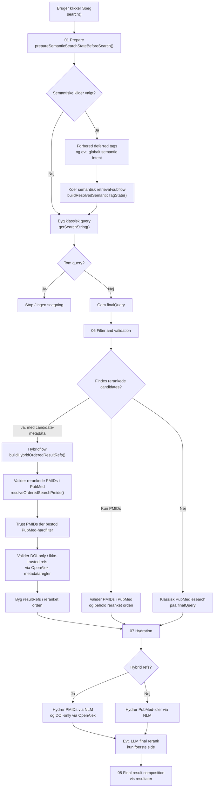
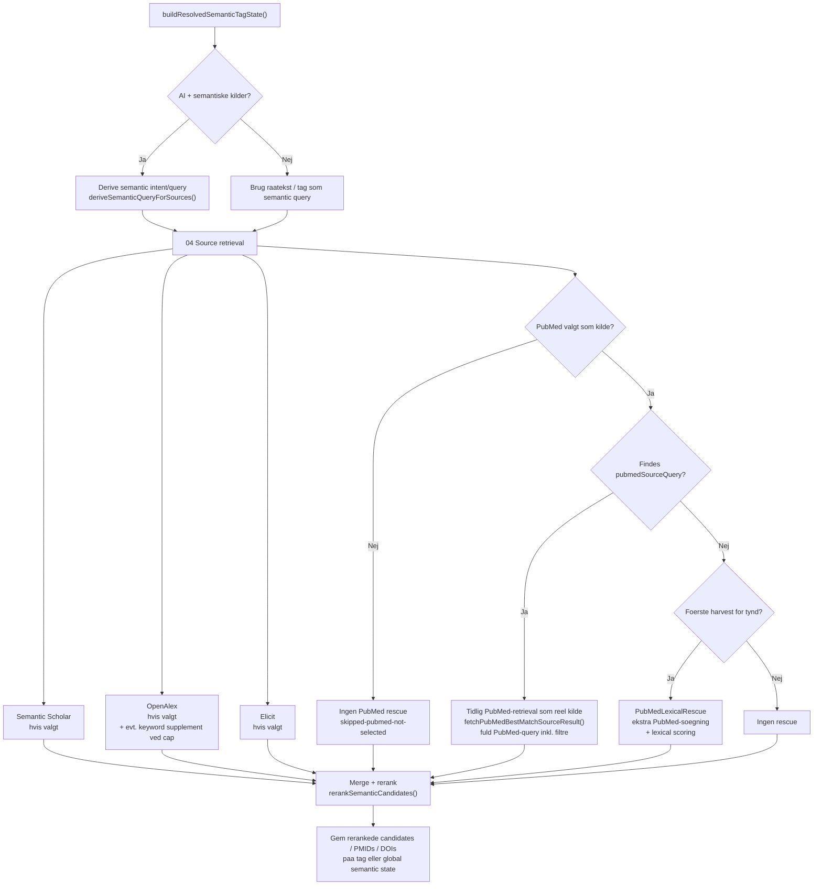
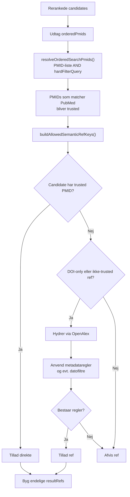
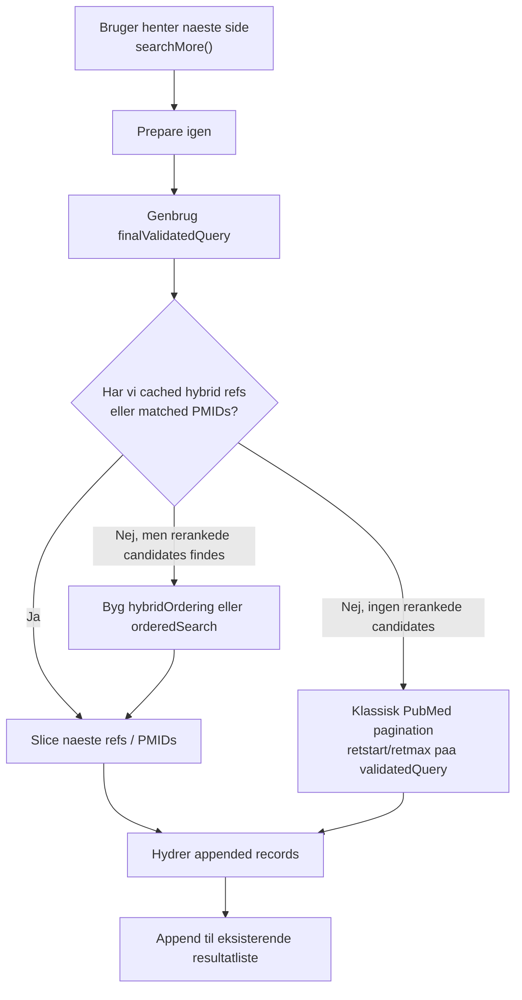

# Search Flow Diagram

Dette dokument beskriver det nuvaerende search flow i `QuickPubMed` ud fra den aktuelle kode i:

- `src/components/SearchForm.vue`
- `src/components/DropdownWrapper.vue`
- `src/utils/semanticReranking.js`

Maalet er at vise alle de vigtigste grene i det nuvaerende flow: klassisk PubMed-soegning, hybridsoegning, semantiske kilder, PubMed som tidlig kilde, PubMed lexical rescue, hard-filtervalidering, DOI-only-regler og pagination.

## 1. Overblik Over Hovedflowet

## 2. Retrieval-Subflow For Semantiske Kilder

## 3. PMID- Og DOI-Validering I Hybridflowet

## 4. Pagination

## 5. Runtime-Matrix

| Scenario | Retrieval | Tidlig PubMed-kilde foer merge | PubMedLexicalRescue | PubMed-validering efter rerank | DOI-only metadataregler |
|---|---|---|---|---|---|
| Kun `PubMed` valgt | Klassisk `getSearchString()` -> PubMed | Nej | Nej | Nej | Nej |
| `PubMed` + semantiske kilder + praedefinerede emner | Semantiske kilder + global semantic state | Ja | Nej, springes over som `skipped-standard-pubmed-retrieval` | Ja | Ja |
| `PubMed` + semantiske kilder + ingen `pubmedSourceQuery` | Semantiske kilder | Nej | Ja, hvis harvest er for tynd | Ja | Ja |
| Kun semantiske kilder valgt | Semantiske kilder | Nej | Nej, springes over som `skipped-pubmed-not-selected` | Ja, for PMID-baserede candidates | Ja |

## 6. Vigtige Noter

- `getSearchString()` bygger den klassiske PubMed-basequery ud fra emner og filtre.
- `prepareSemanticSearchStateBeforeSearch()` opretter kun global semantic state, naar der findes semantiske kilder, ingen ventende tags er tilbage, og der findes et semantic intent-input.
- `pubmedSourceQuery` kommer i det nuvaerende flow fra `getGlobalSemanticPubMedSourceQuery()`, som bruges ved global semantic state for praedefinerede dropdown-emner.
- Hvis `PubMed` ikke er valgt som kilde, koeres `PubMedLexicalRescue` ikke.
- Hvis `PubMed` er valgt, men der allerede findes en standard PubMed-retrieval som reel kilde i samme gren, springes lexical rescue over.
- PMIDs, som har bestaaet PubMed-hardfiltervalidering, trusted i hybridflowet og afvises ikke bagefter af det semantiske metadataregel-lag.
- DOI-only og ikke-trusted refs gaar stadig gennem OpenAlex-baseret metadata-validering.
- Ved dato-sortering kan hybridrefs blive hydreres bredere og derefter sorteret paa dato.
- `searchMore()` genbruger caches og `finalValidatedQuery`, saa pagination ikke genstarter hele retrievallogikken fra bunden.

## 7. Kort Opsummering

Det nuvaerende flow er et hybridt search flow med fire centrale principper:

1. Klassiske PubMed-soegestrenge er stadig det kanoniske query-lag.
2. Semantiske kilder kan udvide kandidatfeltet og derefter flettes i en samlet reranking.
3. PubMed bruges som valideringslag for PMID-baserede candidates.
4. DOI-only records kan stadig komme med, hvis de overlever de metadataregler, der er defineret for det aktive filterset.
